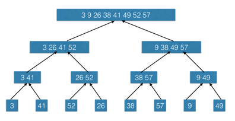

***
### Exercise 2.3-1
Using Figure 2.4 as a model, illustrate the operation of merge sort on the array A = [3, 41, 52, 26, 38, 57, 9, 49].
### `Answer`


***
### Exercise 2.3-2
Rewrite the MERGE procedure so that it does not use sentinels, instead stopping once either array L or R has had all its elements copied 
back to A and then copying the remainder of the other array back into A.
### `Answer`
```C++
void Merge(int arr[],int beg,int mid,int end){
    int temp[n];
    int i=beg, j=mid+1, k=beg;
    while(i<=mid && j<=end){
        if(arr[i]<=arr[j])
            temp[k++] = arr[i++];
        else
            temp[k++] = arr[j++];
    }
    while(i<=mid)
        temp[k++] = arr[i++];
    while(j<=end)
        temp[k++] = arr[j++];
    for(i=beg;i<=end;i++)
        arr[i] = temp[i];
}
```

***
### Exercise 2.3-3
Use mathematical induction to show that when n is an exact power of 2, the solution of the recurrence  
```
T(n) = 2           if n = 2  
      2T(n/2)+n    if n = 2^k , for k>1  
```
is T(n) = nlg(n).
### `Answer`
Let there exists a k > 1 such that T(2<sup>k</sup>) = 2<sup>k</sup>lg(2<sup>k</sup>). We need to prove that the formula holds for n = 2<sup>k+1</sup>.  
T(2<sup>k+1</sup>) = 2T(2<sup>k+1</sup>/2) + 2<sup>k+1</sup>  
 &nbsp; &nbsp; &nbsp; &nbsp; &nbsp; &nbsp;= 2T(2<sup>k</sup>) + 2\*2<sup>k</sup>  
 &nbsp; &nbsp; &nbsp; &nbsp; &nbsp; &nbsp;= 2\*2<sup>k</sup>lg(2<sup>k</sup>) + 2\*2<sup>k</sup>  
 &nbsp; &nbsp; &nbsp; &nbsp; &nbsp; &nbsp;= 2\*2<sup>k</sup>(lg(2<sup>k</sup>) + lg2)  
 &nbsp; &nbsp; &nbsp; &nbsp; &nbsp; &nbsp;= 2<sup>k+1</sup>lg(2<sup>k+1</sup>)  
This induction holds for the above formula.  
Hence T(n) = nlg(n).

***
### Exercise 2.3-4
Insertion sort can be expressed as a recursive procedure as follows. In order to sort A[1..n], we recursively sort A[1..n -1] and then insert A[n] into the sorted array A[1..n - 1]. Write a recurrence for the running time of this recursive version of insertion sort.
### `Answer`
T(n) =  1 &nbsp; &nbsp; &nbsp;if n=1  
 &nbsp; &nbsp; &nbsp; &nbsp; &nbsp; T(n-1) + (n-1) &nbsp; &nbsp; &nbsp;if n>1
 
***
### Exercise 2.3-5
Referring back to the searching problem (see Exercise 2.1-3), observe that if the sequence A is sorted, we can check the midpoint of the sequence against v and eliminate half of the sequence from further consideration. Binary search is an algorithm that repeats this procedure, halving the size of the remaining portion of the sequence each time. Write pseudocode, either iterative or recursive, for binary search. Argue that the worst-case running time of binary search is Θ(lg n).
### `Answer`
```
Binary_search(arr[],beg,end,key){
  if beg<=end
      mid = (beg+end)/2;
      if arr[mid]=key
          return true
      else if key<arr[mid]
          Binary_search(arr,beg,mid-1,key)
      else
          Binary_search(arr,mid+1,end,key)
  else
      return false
}
```
T(n) = T(n/2) + C  
This algorithm always divides the problem in two halfs. So worst case time complexity will be Θ(lg n).

***
### Exercise 2.3-6
Observe that the while loop of lines 5 - 7 of the INSERTION-SORT procedure in Section 2.1 uses a linear search to scan (backward) through the sorted subarray A[1..j - 1]. Can we use a binary search (see Exercise 2.3-5) instead to improve the overall worst-case running time of insertion sort to Θ(n lg n)?
### `Answer`
Although number of comparison can be reduced by using binary search. But still we need to shift the elements to the right to place the key element. And average time complexity for shifting will be Θ(n). Still time complexity of insertion sort will be Θ(n<sup>2</sup>).

***
### Exercise 2.3-7
Describe a Θ(n lg n)-time algorithm that, given a set S of n integers and another integer x, determines whether or not there exist two elements in S whose sum is exactly x.
### `Answer`
**Method 1:** First we need to sort the elements by using merge_sort or quick sort. Then we take one element say `k`, and find the complement of this which is `x-k` by using binary search. If the complement `x-k` is found then we return true. Otherwise we check for next element and do the same.
```
Find_set(s[],x)
    sort(s[])
    for i=1 to n-1
        remain = x-s[i]
        if Binary_search(s[],i+1,n,remain)=true
            return true
    return false
```
**Method 2:** First sort the elements using Θ(lgn) algorithm. Initialize two indices say `p` and `q`, one from the left and one from the right. If the sum `S[p]+S[q]` is greater than `x`, then reduce the right index `q` by 1. If the sum `S[p]+S[q]` is smaller than `x`, then increase the left index `p` by 1. If the sum `S[p]+S[q] = x` then we return true. We try to find the sum set until `p<q`.
```
Find_sum_set(s[],x)
    sort(S[])
    p=1
    q=n
    while p<q
        if S[p]+S[q] = x
            return true
        else if S[p]+S[q] > x
            q = q-1
        else
            p = p+1
    return false
```
